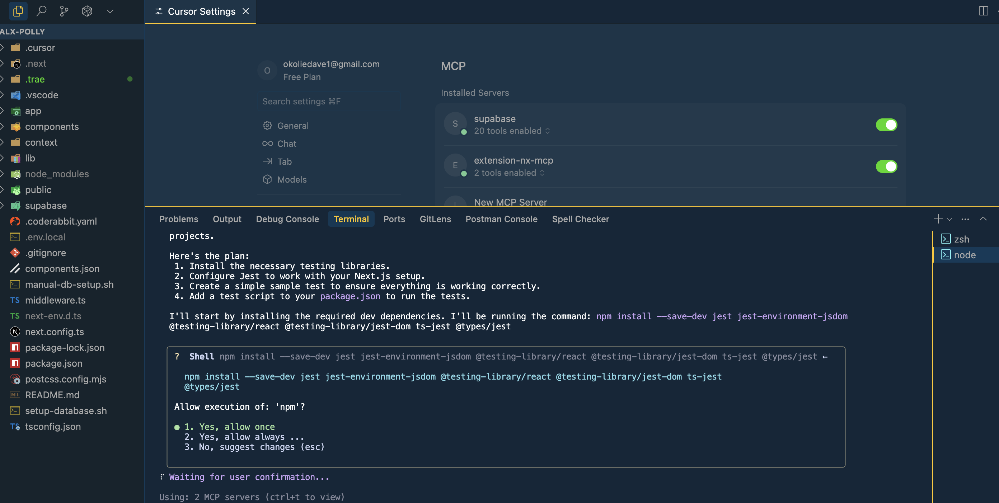

# ALX Polly: Enhanced Polling Application

This project extends the core ALX Polly application, a full-stack polling platform built with Next.js, React, and Supabase. It aims to provide a more robust and feature-rich experience for users to create, manage, vote on, and analyze polls. The enhancements focus on improving user engagement, data insights, and overall application reliability.

## Features Implemented

- **User Authentication:** Users can sign up and log in using email and password.
- **Poll Creation:** Authenticated users can create new polls with multiple options.
- **Poll Voting:** Users can vote on existing polls.
- **Real-time Results:** View real-time updates of poll results.
- **Poll Management:** Users can view and manage their created polls.
- **QR Code Generation:** Each poll has a QR code for easy sharing.
- **Charts:** Advanced poll result visualization with a piechart.

## Technologies Used

- **Frontend:**
  - Next.js (React Framework)
  - React
  - TypeScript
  - Tailwind CSS (for styling)
- **Backend:**
  - Supabase (PostgreSQL Database, Authentication, Edge Functions)
- **Testing:**
  - Jest
  - React Testing Library
- **Deployment:**
  - Vercel (for Next.js application)
- **Additional Libraries/Tools (Planned):**
  - Email Service (e.g., Nodemailer, SendGrid) for notifications.
  - Charting Library (e.g., Chart.js, Recharts) for advanced poll result visualization.
  - (Potentially) a dedicated state management library (e.g., Zustand, Jotai) for more complex client-side state.

## Setup and Run Instructions

### Prerequisites

- Node.js (v18 or higher)
- npm or yarn
- A Supabase project

### 1. Clone the repository

```bash
git clone https://github.com/your-username/alx-polly.git
cd alx-polly
```

### 2. Install dependencies

```bash
npm install
# or
yarn install
```

### 3. Set up Supabase

1.  **Create a new Supabase project:** Go to [Supabase](https://app.supabase.com/) and create a new project.
2.  **Get your Supabase URL and Anon Key:** You can find these in your project settings under "API".
3.  **Set up environment variables:** Create a `.env.local` file in the root of your project and add the following:

    ```
    NEXT_PUBLIC_SUPABASE_URL=YOUR_SUPABASE_URL
    NEXT_PUBLIC_SUPABASE_ANON_KEY=YOUR_SUPABASE_ANON_KEY
    ```

4.  **Run database migrations:**
    You can use the provided `manual-db-setup.sh` script to set up your database schema.

    ```bash
    chmod +x manual-db-setup.sh
    ./manual-db-setup.sh
    ```

    Alternatively, you can manually create the tables and RLS policies as defined in the Supabase documentation for this project.

### 4. Run the development server

```bash
npm run dev
# or
yarn dev
```

Open [http://localhost:3000](http://localhost:3000) with your browser to see the result.

## AI Integration Strategy

This project extensively leveraged AI tools throughout its development lifecycle to enhance productivity, code quality, and collaboration. Specifically:

- **Gemini CLI Agent:** Used for scaffolding new features, generating boilerplate code for components, API routes, and database interactions. It assisted in creating utility functions and data models, ensuring adherence to existing project conventions and best practices.
- **Cursor IDE:** The development environment of choice, integrating AI capabilities directly into the coding workflow for intelligent code completion, suggestions, and refactoring.
- **Code Generation:** The Gemini CLI agent and Cursor IDE were instrumental in generating boilerplate code, utility functions, and basic component structures. They assisted in creating data models and ensuring adherence to existing project conventions.
- **Testing:** AI tools were prompted to generate unit and integration tests for new and existing functionalities. This included suggesting test cases, writing test suites using Jest and React Testing Library, and ensuring comprehensive test coverage.
- **Documentation:** AI assisted in crafting and maintaining documentation, including generating JSDoc/TSDoc comments for functions and interfaces, writing inline comments for complex logic, and updating the `README.md` and `reflection.md` files.
- **Code Rabbit:** Employed for automated code reviews, providing constructive feedback, identifying potential issues, and ensuring code quality and adherence to best practices.
- **Model-Context-Protocol (MCP) Workflow:** A structured approach was followed where the AI model (Gemini CLI) was given a clear prompt, generated code, and then the solution was refined through iterative feedback and adjustments. This protocol was particularly effective when integrating with Supabase, leveraging its API specifications and database schema to inform AI-driven development.
- **Context-aware techniques:** The Gemini CLI agent was provided with API specifications, the project's file tree, and code diffs to maintain context during development. This allowed the AI to understand the project's architecture, existing code patterns, and dependencies, leading to more accurate and relevant code suggestions and modifications. For example, when implementing a new feature, the AI was given the relevant API routes, database schema, and existing component code to ensure seamless integration.

## AI Collaboration in Action

Below is a screenshot demonstrating the collaborative development process with AI:


